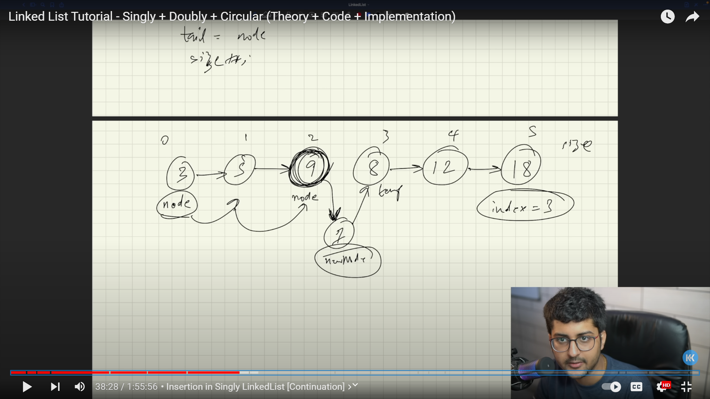

**SINGLY LINKED LIST**
```
public class LL {

    private Node head;
    private Node tail;
    private int size;
```
- This class represents the linked list data structure.
- It has private member variables head, tail, and size to manage the list.
- head points to the first node,
- tail points to the last node,
- size keeps track of the number of nodes in the list.

The constructor 
```
    public LL() {
        this.size = 0;
    }
```
- It sets the size of the linked list to 0.
- This means that when you create a new linked list object using LL list = new LL();, it starts with an empty list (zero elements).

**Why is it Important?** 

- Setting the size to 0 ensures that the linked list is properly initialized before any operations are performed on it.
- It provides a starting point for tracking the number of elements in the list.

```
    private class Node {
        private int value;
        private Node next;
```
- The nested Node class defines the individual nodes of the linked list.
```
        public Node(int value) {
            this.value = value;
        }
```
- This constructor creates a new node with the given value.
- It initializes the value of the node with the provided value.
- The next reference of the node remains uninitialized (null by default), indicating that this node is not linked to any other node.
```
        public Node (int value, Node next) {
            this.value = value;
            this.next = next;
        }
    }
```
- This constructor also creates a new node with the given value.
- Additionally, it specifies the next node to which this new node will be linked.
- It initializes both the value and next reference of the node with the provided values.
- This allows you to create nodes and establish their connections to other nodes in a single step.

**Inserting Node at First (head)**


- First, a new node is created with the given value (val).
- The next reference of the newly created node is set to point to the current head of the linked list.
- The head reference of the linked list is updated to point to the newly inserted node.

- If the linked list was previously empty (meaning tail is null), the tail reference is also updated to point to the new node.
- This is because when the list is empty, the new node also becomes the last node in the list.
- Finally, the size of the linked list (size) is incremented by 1 to reflect the addition of the new node.
  
  ```
    public void insertFirst(int val) {
        Node node = new Node(val);
        node.next = head;
        head = node;

        if(tail == null) {
            tail = head;
        }

        size += 1;
    }
  ```
**Inserting Node at Last (Tail)**


- The method checks if the tail reference is null, indicating that the linked list is empty.
- If the list is empty, the method calls the insertFirst method to insert the new node at the beginning of the list.
- If the list is not empty, a new node is created with the provided value (val).
- The next reference of the current last node (tail) is updated to point to the new node.
- Now, the new node becomes the last node in the list.
- The size of the linked list is incremented by 1 to reflect the addition of the new node.

```
    public void insertLast(int val){
        if(tail == null) {
            insertFirst(val);
            return;
        }
        Node node = new Node(val);
        tail.next = node;
        tail = node;
        size+=1;
    }
```
  **Inserting Node by its Index Value**

  

- The method first checks if the specified index is 0
- In this case, it calls the insertFirst method to handle the insertion.
- Next, it checks if the specified index is equal to the current size of the list. If so, it calls the insertLast method to handle the insertion at the end of the list.

- The method iterates through the list using a temporary variable temp, starting from the head, until it reaches the node just before the insertion point (at index index - 1).
- Once the insertion point is found, a new node is created with the provided value (val), and its next reference is set to the node currently at the insertion point (temp.next).
- Then, the next reference of the previous node (temp) is updated to point to the new node, effectively inserting it into the list at the specified index.
  
```
    public void insert (int val, int index){
        if (index == 0){
            insertFirst(val);
            return;
        }
        if(index == size){
            insertLast(val);
            return;
        }
        Node temp = head;
        for(int i = 1; i < index; i++){
            temp = temp.next;
        }
        Node node = new Node(val, temp.next);
        temp.next = node;
    }
```
**Deleting Node at First (Head)**


**Displaying Node**

- The method starts by initializing a temporary variable temp with the reference to the head node.
- This variable is used to traverse the linked list, starting from the beginning.
- It enters a loop that continues until the temp variable becomes null, indicating the end of the list.
- During each iteration of the loop, it prints the value of the current node (temp.value) followed by a "->" to separate node values.
- After printing the value of the current node, the temp variable is updated to point to the next node in the list (temp = temp.next).
- This process continues until all nodes in the list have been traversed and printed.
- Once the loop exits (when temp becomes null), it prints "END" to indicate the end of the printed list.

```
    public void display() {
        Node temp = head;
        while (temp != null) {
            System.out.print(temp.value + " -> ");
            temp = temp.next;
        }
        System.out.println("END");
    }
}
```
**USAGE**
```
package src;

public class Main {
    public static void main(String[] args) {
        LL list = new LL();
        list.insertFirst(12);
        list.insertFirst(5);
        list.insertFirst(18);
        list.insertFirst(25);
        list.insertFirst(6);
        list.insertFirst(29);
        list.insertLast(99);
        list.insert(24, 2);
        list.display(); //Output:- 29 -> 6 -> 24 -> 25 -> 18 -> 5 -> 12 -> 99 -> END
    }
}

```
