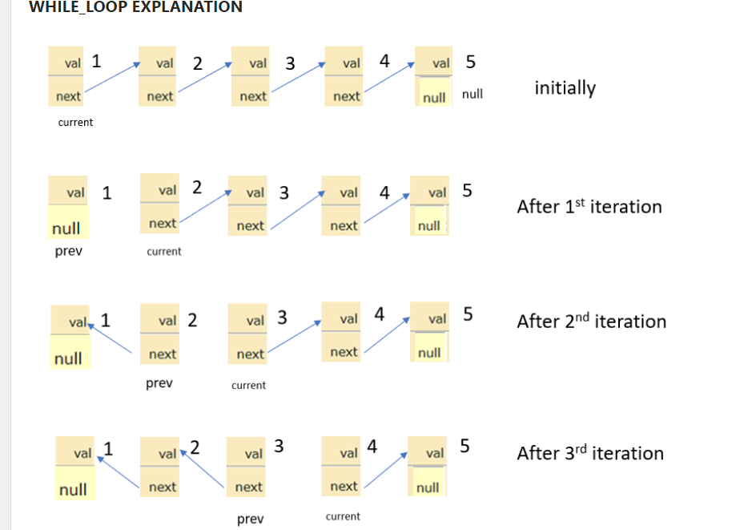
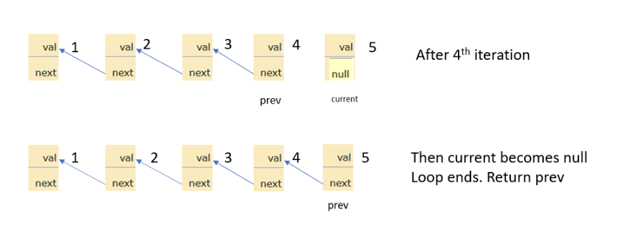

**206 Reverse Linked List**

Given the head of a singly linked list, reverse the list, and return the reversed list.

Example 1:

Input: head = [1,2,3,4,5]

Output: [5,4,3,2,1]

Example 2:

Input: head = [1,2]

Output: [2,1]

Example 3:

Input: head = []

Output: []
 
Constraints:

The number of nodes in the list is the range [0, 5000].
-5000 <= Node.val <= 5000

```
/**
 * Definition for singly-linked list.
 * public class ListNode {
 *     int val;
 *     ListNode next;
 *     ListNode() {}
 *     ListNode(int val) { this.val = val; }
 *     ListNode(int val, ListNode next) { this.val = val; this.next = next; }
 * }
 */
class Solution {
    public ListNode reverseList(ListNode head) {
        ListNode prev = null;
        ListNode current = head; 
        while (current!=null){
            ListNode next = current.next; 
            current.next = prev; 
            prev = current; 
            current = next; 
        }
        return prev;
    }
}
```
**Initial State:**
```
1 -> 2 -> 3 -> 4 -> 5 -> null
^
|
head
prev = null
current = head
```
**Iteration 1:**
- Hold the Previous Node (prev):
- prev = null
- Flip the Current Node (current):
- Disconnect current node from next and point it to previous.
- current.next = prev
```
1 <- 2 -> 3 -> 4 -> 5 -> null
^    ^
|    |
prev current
```
- Move to the Next Node (current):
- prev = current
- current = current.next
```
1 <- 2 -> 3 -> 4 -> 5 -> null
     ^    ^
     |    |
    prev current
```
**Iteration 2:**
- Hold the Previous Node (prev):
- prev = 1
- Flip the Current Node (current):
- Disconnect current node from next and point it to previous.
- current.next = prev
```
1 <- 2 <- 3 -> 4 -> 5 -> null
         ^    ^
         |    |
        prev current
```
- Move to the Next Node (current):
- prev = current
- current = current.next
```
1 <- 2 <- 3 -> 4 -> 5 -> null
                ^    ^
                |    |
               prev current
```
**Iterations 3, 4, and 5:**
- These iterations follow the same pattern, moving prev and current to the next nodes and flipping the direction of the connections.

**Final State:**
- After iterating through all nodes:
```
1 <- 2 <- 3 <- 4 <- 5 -> null
                         ^
                         |
                       head (prev)
```
**Returning the New Beginning:**
The prev pointer is now holding onto the last node, which is the new beginning of the reversed list. So, we return prev.

**Conclusion:**
The original linked list 1 -> 2 -> 3 -> 4 -> 5 has been successfully reversed to 5 -> 4 -> 3 -> 2 -> 1.





## Reverse a Linked List in Groups [https://www.geeksforgeeks.org/problems/reverse-a-linked-list-in-groups-of-given-size/1]

**Youtube Video** [https://www.youtube.com/live/HTeFoe7x1F8?si=U9o9FTdnwYRcFlRO]

Given a linked list of size N. The task is to reverse every k nodes (where k is an input to the function) in the linked list. If the number of nodes is not a multiple of k then left-out nodes, in the end, should be considered as a group and must be reversed (See Example 2 for clarification).

## Example 1:

Input:

LinkedList: 1->2->2->4->5->6->7->8

K = 4

Output: 4 2 2 1 8 7 6 5 

Explanation: 

The first 4 elements 1,2,2,4 are reversed first and then the next 4 elements 5,6,7,8. Hence, the 

resultant linked list is 4->2->2->1->8->7->6->5.

## Example 2:

Input:

LinkedList: 1->2->3->4->5

K = 3

Output: 3 2 1 5 4 

Explanation: 

The first 3 elements are 1,2,3 are reversed 

first and then elements 4,5 are reversed.Hence, 

the resultant linked list is 3->2->1->5->4.

## Your Task:

You don't need to read input or print anything. Your task is to complete the function reverse() which should reverse the linked list in group of size k and return the head of the modified linked list.

**Expected Time Complexity :** O(N)
**Expected Auxilliary Space :** O(1)

Constraints:
1 <= N <= 105
1 <= k <= N

## Code

```
class Solution
{
    public static Node reverse(Node node, int k)
    {
        //Your code here
        if(node == null)
            return null;
        
        Node prev = null;
        Node curr = node;
        Node next = null;
        int c = 0;
        while(curr!=null && c < k){
            next = curr.next;
            curr.next = prev;
            prev = curr;
            curr = next;
            c++;
        }
        if(next!=null){
            node.next = reverse(next, k);
        }
        return prev;
    }
}
```
